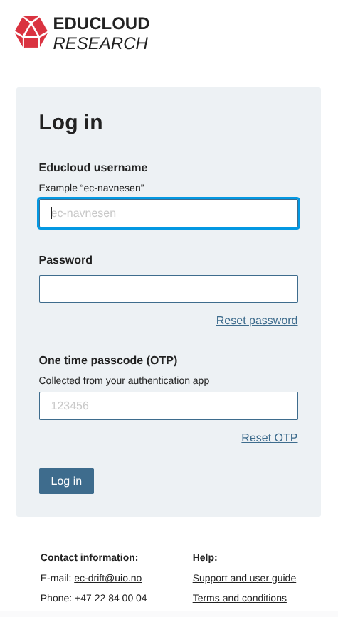
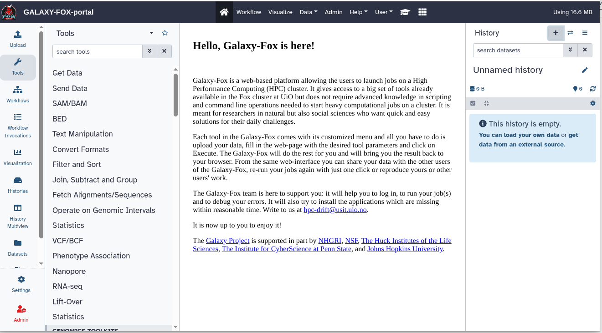

# Galaxy project at UiO - combining the web interface and power of a high performance computer cluster FOX
At USIT (https://www.usit.uio.no/) we have a galaxy instance which is connected to the High Performance Computing cluster FOX (https://galaxy.educloud.no). This instance has more than 6500 tools for bioinformatics, it actually mounts the tool directory from the Galaxy project (by CVMFS). CVMFS (CernVM File System) is a service which deploys software and reference data on computing infrastructure. CernVM-FS is a read-only file system where the applications and reference data are hosted on servers outside the computing infrastructure (FOX cluster, in our case) and are mounted in the Galaxy server as any other directory.   The galaxy-on-FOX instance is connected to an HPC cluster and allows for complex and heavy calculations. It also proposes a substantial storage of 1TB for each user. The datasets in this storage are manageable directly from the Galaxy by its file manager.  Galaxy-on-FOX is free to use and provides a daily user support for all interested users. It is very convenient for courses and teamwork in groups as it allows for sharing of resources and for reproduction both of procedures and results. It can easily integrate partners from national and foreign institutions.

## Instructors
Nikolay Vazov, Torfinn Nome, Sabry Razick, Pubudu Saneth Samarakoon

## Prerequisites 

1. A laptop with a WiFi connectivity and a common browser : Google Chrome, Firefox, Edge, Safari ...
   
2. Before the start of the course it is recommended that all the participants :
   
   -  Apply for the ec73 project in Educloud. Please follow the attached document : [Instructions to apply for the Galaxy project in Educloud](./GALAXY-FOX-portal-application.pdf). The user support will receive an e-mail with your application and will approve your membership to ec73. 
       - _why do you need this?_ : The web platform Galaxy sends its calculations for execution to the High Performance Computing (HPC) cluster FOX. To optimize the performance and management, clusters require that all calculations (jobs) run in dedicated projects. All users must be members of a cluster project in order to be allowed to run cluster jobs. Galaxy on FOX uses project ec73 and this is the project all the users shall apply for.
       
   -  Set up two-factor authentication, often referred to as OTP (One Time Passcode). You can set this up using ID-porten and an authentication app on your mobile. Please refer to the following link for detailed instructions [Set up two-factor authentication](https://www.uio.no/english/services/it/research/platforms/edu-research/help/two-factor-authentication.html)
  
3.  After executing the two steps above, please log in to Galaxy using your username and password from the application and your OTP (One Time Passcode) generated on your mobile phone. To do this go to (https://galaxy.educloud.no/) and click on the Login button.
     
     

     
     

   - If you succeed, you shall see the following page
     
     

## Live Troubleshooting Session

## Software Requirements
